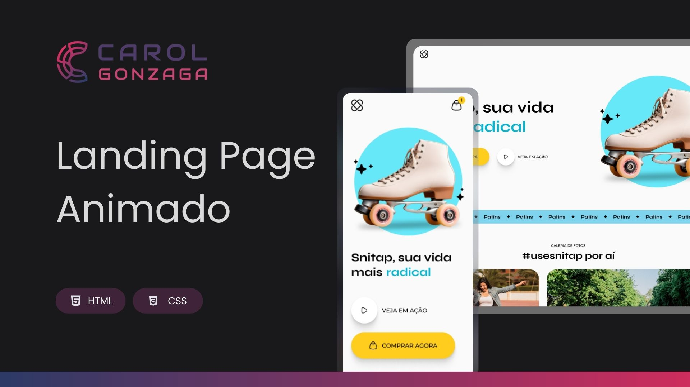

  

 

Um projeto que apresenta uma Landing Page responsiva de um patins com muitas animações e transições.

  <a href="#-tecnologias">Tecnologia</a>&nbsp;&nbsp;&nbsp;|&nbsp;&nbsp;&nbsp;<a href="https://carolgonzaga.github.io/landing-page-animado/">Acesse o Projeto</a>

 
 

  

 
 

## 🚀 Tecnologias

Esse projeto foi desenvolvido com as seguintes tecnologias:

- HTML5
- CSS3

 
 

## 🎯 Objetivo

O intuito deste projeto é treinar os conceitos sobre transições e animações aprendidos em aula, através da criação de uma landing page animada. A interface foi desenvolvida para oferecer uma experiência única e intuitiva, demonstrando a aplicação prática usando HTML e CSS.
